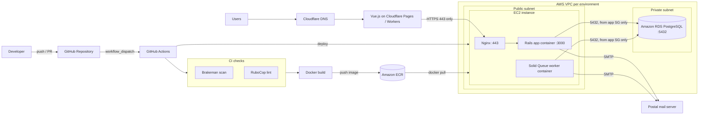

# Trainings Manager: CI/CD & Cloud Deployment


The DevOps setup behind **Trainings Manager**, a training management platform with a Vue.js frontend, a Ruby on Rails backend and a PostgreSQL database on Amazon RDS. This repository contains the deployment pipelines, branch protection rules and server configuration I designed and run. Application code is not included.

## What this project covers

- **Four environments:** `dev`, `release`, `demo` and `prod`, each with its own AWS credentials, ECR tag and EC2 host
- **Security and quality gates:** every backend deploy runs a Brakeman security scan and RuboCop linting before an image is built
- **Containerized backend:** Docker images are built in GitHub Actions, pushed to Amazon ECR, and pulled onto EC2
- **Network isolation:** the app server sits in a public subnet and accepts web traffic only on HTTPS (port 443); the PostgreSQL database runs on Amazon RDS in a private subnet with no internet access
- **Two containers per instance:** the Rails app (behind Nginx) and a Solid Queue background worker, deployed by separate pipelines
- **Automated post-deploy tasks:** schema migrations, data migrations and seeds run inside the new container
- **Health check and rollback signal:** the pipeline fails and prints container logs if the new container is not running
- **Edge-hosted frontend:** the Vue.js app is served from Cloudflare Pages and Workers, with DNS on Cloudflare
- **Bulk email:** the backend sends mail through a Postal mail server

## Architecture



### Network and security

| Layer | Placement | Inbound access |
|---|---|---|
| EC2 app server (Nginx, app, worker) | Public subnet | HTTPS **443** only, via its security group |
| Amazon RDS for PostgreSQL | Private subnet | PostgreSQL **5432** only from the app server's security group |

The database has no public IP and cannot be reached from the internet. Only the app and worker containers on the EC2 instance can connect to it, which limits the attack surface to a single HTTPS entry point.

## Deployment flow (backend app)

1. **Security scan:** Brakeman checks the Rails code for vulnerabilities.
2. **Lint:** RuboCop runs and reports issues as GitHub annotations.
3. **Build and push:** only if both checks pass, the image is built and pushed to ECR with the environment tag (for example `demo`).
4. **Deploy:** GitHub Actions connects to the environment's EC2 host over SSH, logs in to ECR, pulls the image and replaces the running container.
5. **Verify:** the pipeline waits for the container and fails with logs if it is not running.
6. **Post-deploy:** `db:migrate`, `data:migrate` and `db:seed` run inside the new container.
7. **Clean up:** unused Docker images and layers are pruned to keep disk usage under control.

The worker pipeline follows the same build → push → deploy path, using the `<env>-worker` tag and starting the container with `bundle exec rake solid_queue:start`.

## Environments

| Environment | App workflow | Worker workflow | Image tags |
|---|---|---|---|
| Dev | `deploy-app-dev.yml` | `deploy-worker-dev.yml` | `dev`, `dev-worker` |
| Release | `deploy-app-release.yml` | `deploy-worker-release.yml` | `release`, `release-worker` |
| Demo | `deploy-app-demo.yml` | `deploy-worker-demo.yml` | `demo`, `demo-worker` |
| Production | `deploy-app-prod.yml` | `deploy-worker-prod.yml` | `prod`, `prod-worker` |

All pipelines are triggered manually (`workflow_dispatch`), so releases to each environment are a deliberate decision. A push trigger per branch is included in each file, commented out, for teams that want automatic deploys.

## Branch protection

`main` is protected (see [`.github/branch-protection.yml`](.github/branch-protection.yml)):

- Pull request required, with **1 approving review**
- Stale approvals are dismissed when new commits are pushed
- Required status checks: `scan_ruby`, `lint` and `test`, and the branch must be up to date before merging

## Repository structure

```
.
├── .github/
│   ├── branch-protection.yml          # Reference copy of the main branch rules
│   └── workflows/
│       ├── deploy-app-{dev,release,demo,prod}.yml
│       └── deploy-worker-{dev,release,demo,prod}.yml
├── docs/
│   └── github-secrets.md              # Secrets each environment needs
├── nginx/
│   └── trainings-manager.conf.example # Reverse proxy to the Rails container
├── .env.example                       # Env file layout used on each EC2 host (incl. RDS DATABASE_URL)
└── README.md
```

## Setup

1. Per environment, create a VPC with a public and a private subnet, an ECR repository, an EC2 instance in the public subnet (Docker and Nginx installed, security group allowing 443), and an RDS PostgreSQL instance in the private subnet (security group allowing 5432 from the EC2 security group only).
2. Place the environment file at `/opt/trainings-manager-<env>/.env` on each instance (see `.env.example`).
3. Configure Nginx using `nginx/trainings-manager.conf.example`.
4. Add the GitHub secrets listed in [`docs/github-secrets.md`](docs/github-secrets.md).
5. Configure branch protection for `main` in **Settings → Branches**.
6. Run a deployment from the **Actions** tab by choosing the workflow and clicking **Run workflow**.

## Planned improvements

- Replace long-lived AWS access keys with **GitHub OIDC** and an IAM role
- Tag images with the **commit SHA** and promote the same image across dev → release → demo → prod instead of rebuilding per environment
- Move the four near-identical workflows into one **reusable workflow** with the environment as an input
- Add the RSpec `test` job to the pipeline so it matches the required status checks
- Use GitHub **Environments** with required reviewers for production deploys

## Author

**Bilal Ahmad**: DevOps Team Lead, AWS & Azure
[LinkedIn](https://www.linkedin.com/in/Bilalahmad786) · [Upwork](https://www.upwork.com/freelancers/~01e0db54858a267270) · [GitHub](https://github.com/bilalahmad984)
